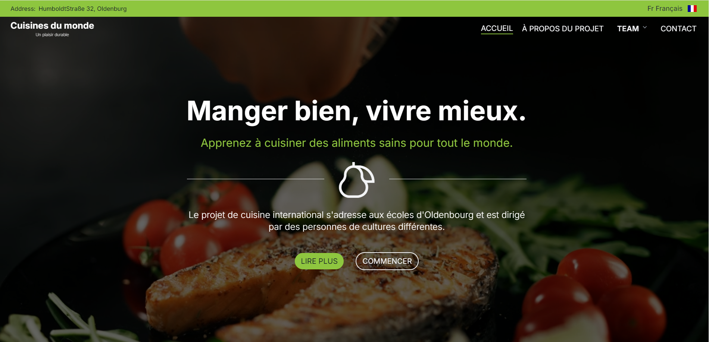

# Cuisines du Monde

Le projet de cuisine international s'adresse aux écoles d'Oldenbourg et est dirigé par des personnes de cultures différentes.

## Fonctionnalités

- Exploration de recettes du monde entier
- Interface multilingue (Anglais, Français, Allemand)
- Carte interactive des origines culinaires
- Galerie de photos de plats

## Technologies utilisées

- [Next.js](https://nextjs.org/) - Framework React pour le rendu côté serveur
- [next-intl](https://next-intl-docs.vercel.app/) - Internationalisation pour Next.js
- [@avectopus/atlas-icons](https://www.npmjs.com/package/@avectopus/atlas-icons) - Bibliothèque d'icônes
- [react-leaflet](https://react-leaflet.js.org/) - Composants React pour les cartes Leaflet
- [Swiper](https://swiperjs.com/) - Carrousel tactile moderne

## Installation

1. Clonez le dépôt
2. Installez les dépendances avec `npm install`
3. Lancez le serveur de développement avec `npm run dev`

## Approche de développement

1. **Internationalisation** : Utilisation de `next-intl` pour gérer les traductions en anglais, français et allemand. Les fichiers de traduction sont stockés dans `/messages/`.

2. **Composants réutilisables** : Création de composants React modulaires pour une meilleure maintenabilité et réutilisation du code.

3. **Carte interactive** : Intégration de `react-leaflet` pour afficher une carte mondiale interactive montrant l'origine des plats.

4. **Galerie de photos** : Utilisation de Swiper pour créer un carrousel fluide et réactif des photos de plats.

5. **Icônes** : Intégration de la bibliothèque `@avectopus/atlas-icons` pour des icônes cohérentes et esthétiques.

6. **Responsive Design** : Utilisation de Tailwind css et de media queries pour assurer une expérience utilisateur optimale sur tous les appareils.

## Déploiement

Le site est déployé sur [Netlify](https://netlify.com) pour profiter de l'intégration native avec Next.js.

## Contribution

Les contributions sont les bienvenues ! N'hésitez pas à ouvrir une issue ou à soumettre une pull request.

